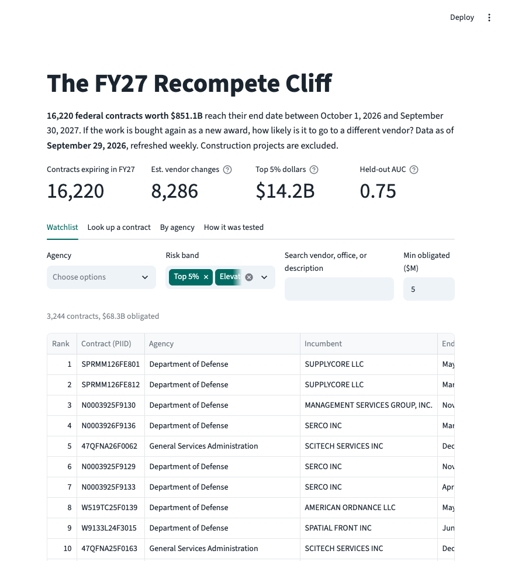
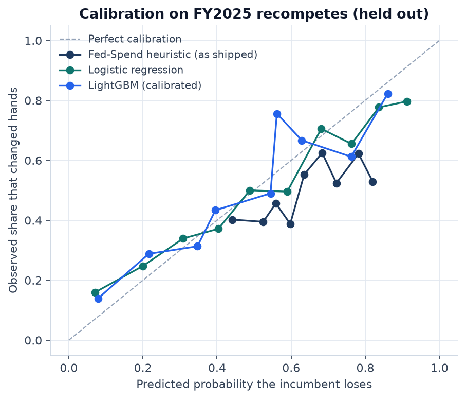
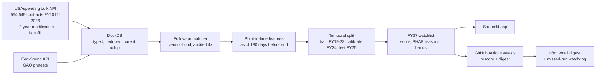

# The FY27 Recompete Cliff

**Which federal contracts ending in FY2027 are most likely to change hands?**

Between October 1, 2026 and September 30, 2027, **16,281 federal contracts of $5M+** (not
construction), carrying **$1,027.2B** in lifetime obligations, reach the end of their current
period of performance. When the work is bought again, some incumbents keep it and some lose it.
Capture teams spend real money guessing which is which. This project builds the ground truth
from public award data, tests whether the loss is predictable six months out, and ships a
weekly-refreshed, ranked watchlist with reasons.



## The answer, in numbers

Tested once on **1,126 recompetes that ended in FY2025**, a year the model never saw:

| | AUC | Top 10% hit rate | Calibration error |
|---|---|---|---|
| Fed-Spend's production heuristic, as shipped | 0.585 | 53% | 0.151 |
| Logistic regression baseline | 0.743 | 80% | 0.059 |
| **LightGBM, calibrated (shipped)** | **0.754** | **88%** | **0.053** |

- Of the 10% of contracts the model flags most strongly, **88% changed hands**, against a 50%
  base rate (1.75x lift).
- The model beats the heuristic by **+0.169 AUC (95% CI +0.131 to +0.207)**. It does **not**
  meaningfully beat plain logistic regression (+0.012, CI includes zero): most of the signal
  is in the features, not the algorithm.
- On high-confidence labels only, AUC is 0.793.

What predicts a vendor change, FY2019 to FY2025 (6,883 labeled recompetes):

| Pattern | Changed hands |
|---|---|
| Last award was competed / was sole-source | 59% / 26% |
| Order under a multiple-award / single-award vehicle | 68% / 42% |
| Two or more offers / one offer | 63-66% / 37% |
| Incumbent holds under 20% / 20%+ of the office's spend | 54% / 25% |
| Incumbent is a small business / is not | 58% / 45% |

The change rate rose from 44% (FY2019) to 55% (FY2024). All of these lean slightly high
because wrong follow-on matches mostly look like vendor changes (see the label audit).



## How it works



1. **Ground truth that did not exist.** Federal data never says "award B replaced award A."
   The matcher finds the follow-on by office, product code, description similarity, timing,
   and size, and **never looks at the vendor** (a unit test proves it). Four rounds of blind
   hand audits reshaped the rules; the final round found 66% clearly the same requirement,
   17% related, 17% wrong. [Label audit](docs/LABEL_AUDIT.md).
2. **No time travel.** Every feature is computed as of 180 days before the contract ended,
   history features only count outcomes knowable at that date, and contracts whose follow-on
   was already awarded by then are dropped as "already decided." Removing every
   label-derived feature leaves AUC unchanged (0.756), so the result is not a leak.
3. **Honest comparison.** Fed-Spend's production vulnerability score is reimplemented and
   graded on the same labels. At 0.585 AUC it is only modestly better than a coin flip, which
   is the most useful finding for the product that ships it.
4. **Operational.** The shipped model is exactly the evaluated one. A weekly job rescores it on
   fresh awards; retraining is a reviewed change. [Model card](docs/MODEL_CARD.md) (NIST AI RMF
   mapped), [methodology](docs/METHODOLOGY.md).

## Run it

```bash
make setup              # uv sync
make download           # USAspending bulk pulls, FY2012-2026 (about 40 minutes, public, no key)
make backfill           # awards modified in the last 2 years: active pre-FY2012 contracts (about 1 hour)
make fedspend           # GAO protests via the Fed-Spend API (key and base URL via Infisical)
make build label features train score
make app                # Streamlit on localhost:8501
make test lint
```

Secrets are never stored in the repo: `scripts/with-secrets.sh` pulls the Fed-Spend key from
Infisical into the process environment at runtime; CI reads it from GitHub Actions secrets.

## Repository

| Path | What |
|---|---|
| `src/recompete/download.py` | USAspending bulk download with async job polling, contracts only |
| `sql/00_awards.sql` | Typing, dedupe, vendor parent rollup |
| `sql/10_candidates.sql`, `src/recompete/label.py` | Follow-on matcher, labels, audit sample |
| `sql/20_features.sql`, `src/recompete/features.py` | Point-in-time features, Fed-Spend heuristic |
| `src/recompete/model.py` | Temporal split, LightGBM + logistic, calibration, bootstrap CIs, SHAP, subgroups |
| `src/recompete/score.py` | FY27 watchlist with per-contract reasons |
| `src/recompete/digest.py` | Week-over-week diff posted to n8n |
| `app/streamlit_app.py` | Watchlist explorer, PIID lookup, agency view, test results |
| `automation/n8n/` | n8n workflow: digest email and missed-run watchdog |
| `.github/workflows/weekly-refresh.yml` | Monday refresh |
| `tableau/exports/watchlist_fy27.csv` | Flat extract for BI tools |

## Limitations

- Labels are inferred, not recorded; 28% of "changed" labels in the final audit were wrong
  matches. Measured performance is attenuated by that noise and change rates lean high.
- Only 7,332 of 59,888 ended contracts get a confident label (boilerplate descriptions and
  requirements that moved offices are unlabeled). Scores apply to contracts like those.
- Contracts signed before FY2012 enter through the two-year modification backfill (61 FY27
  contracts, $176.1B). The model was evaluated before that backfill and not retrained on it.
- No CPARS, pricing, or proposal data. The model sees award patterns, not performance.
- Weaker for small-business incumbents (AUC 0.69) and small agencies (0.60).
- A score describes a pattern, not a judgment about any incumbent.

Built by [Jason Pellerin](https://www.jasonpellerin.com). Data: USAspending.gov (public
domain), GAO bid protest docket via Fed-Spend. MIT license.
